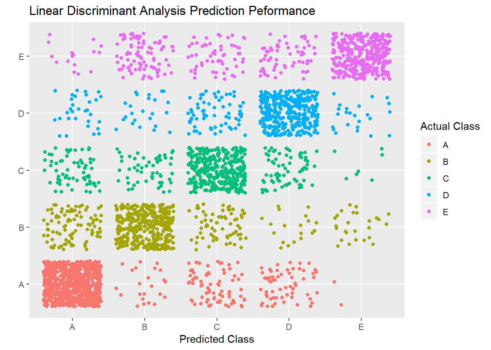
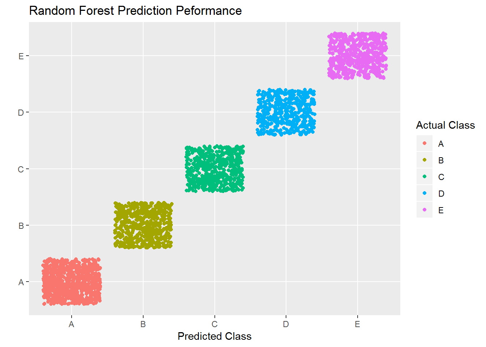
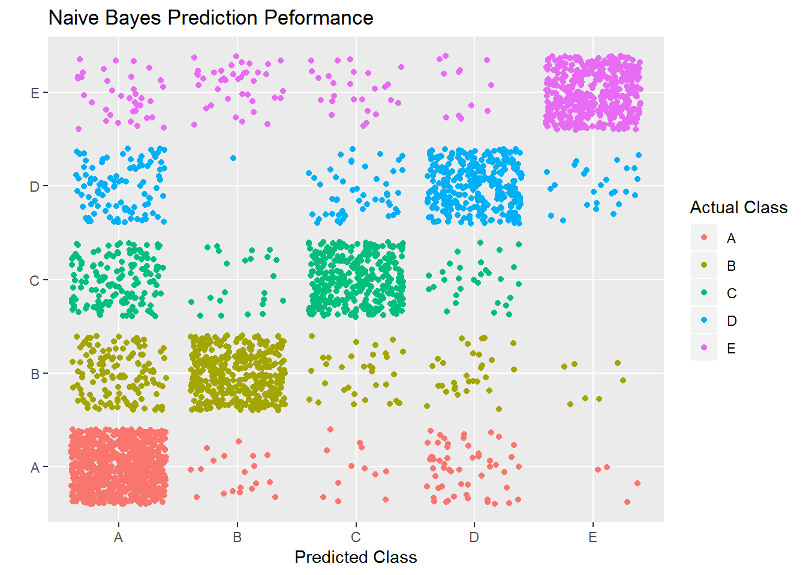

## Summary  
  
The goal of this course project was to use what I learned in class to apply 
machine learning techniques to a real-world data set. Training and test data were
obtained from the course website and were generously provided by [Groupware@LES](http://groupware.les.inf.puc-rio.br/har). 
They are part of a human activity recogition study that aimed to measure the 
quality of a dumbbell curl exercise and consist of observations from a number of 
on-body sensors. Participants performed the curl correctly and with 4 common
mistakes, and the goal of the research was to create a model to distinguish among
these outcomes based on sensor data (see the researchers' website for more 
information).  
  
After reading and preparing the data, I split approximately 20% of the training 
set and reserved it for cross-validation. I then fit a number of models on the 
remaining training data using caret, assessed them using the validation data,
and ultimately chose a gradient-boosted model from the `xgboost` package. The 
final predictions are given at the very end of this document.  
  
## Data preparation  
  
Load required packages:  
  


```r
library(caret); library(ggplot2); library(dplyr)
```
    
Read data:    
  

```r
train <- read.csv("pml-training.csv")
test <- read.csv("pml-testing.csv")
```
  
The data contained a lot of variables I didn't need or couldn't use because of a very
high proportion of missing values:  
  

```r
## In the training data
train <- select(train, 8:ncol(train))
na.cols <- colSums(is.na(train)) > 0
train <- train[,!(na.cols)]
blank.cols <- colSums(train == "") > 0
train <- train[,!(blank.cols)]
  
## And in the test data
test <- select(test, 8:ncol(test))
na.cols <- colSums(is.na(test)) > 0
test <- test[,!(na.cols)]
blank.cols <- colSums(test == "") > 0
test <- test[,!(blank.cols)]
```

I also transformed the `classe` variable (the outcome I wanted to predict) to a
factor so that I could create my trained models without relying on R's formula
notation, which is computationally ineffient:


```r
train$classe <- factor(unclass(train[53])[[1]])
```
   
In order to assess multiple models and choose the best one without overfitting,
I took a slice of my training set and reserved it for cross validation:  
  

```r
set.seed(5209)
inValidation <- createDataPartition(train$classe, p = .2, list = F)
train <- train[-inValidation,]
validate <- train[inValidation,]
badvalid <- apply(validate, 1, function(x){sum(is.na(x)) > 0})
validate <- validate[!(badvalid),]
```
  
## Model fitting  
  
I compared a number of models:  
  

```r
ldamodel <- train(x = train[1:52], y = train$classe, method = "lda")
rfmodel <- train(x = train[1:52], y = train$classe, method = "rf")
bayesmodel <- train(x = train[1:52], y = train$classe, method = "nb")
boostmodel <- train(train[1:52], train$classe, method="xgbTree")
```
  
## Model performance  
  
To make it a bit simple for myself downstream, I set my reference value to 
its own variable:  
  

```r
known <- validate$classe
```
  
  
**Linear Discriminant Analysis**  
    
First, use the model to predict outcomes on the cross-validation set:  
  

```r
ldapred <- predict(ldamodel, validate)
```
  
Then, evaluate its performance using `confusionMatrix`:  
  

```r
print(ldaperf <- confusionMatrix(ldapred, known))
```

```
## Confusion Matrix and Statistics
## 
##           Reference
## Prediction   A   B   C   D   E
##          A 745  95  65  31  16
##          B  23 391  53  24  92
##          C  77  69 359  67  58
##          D  60  19  73 354  61
##          E   2  26   7  24 359
## 
## Overall Statistics
##                                           
##                Accuracy : 0.701           
##                  95% CI : (0.6846, 0.7169)
##     No Information Rate : 0.2879          
##     P-Value [Acc > NIR] : < 2.2e-16       
##                                           
##                   Kappa : 0.621           
##                                           
##  Mcnemar's Test P-Value : < 2.2e-16       
## 
## Statistics by Class:
## 
##                      Class: A Class: B Class: C Class: D Class: E
## Sensitivity            0.8214   0.6517   0.6445   0.7080   0.6126
## Specificity            0.9077   0.9247   0.8955   0.9196   0.9770
## Pos Pred Value         0.7826   0.6707   0.5698   0.6243   0.8589
## Neg Pred Value         0.9263   0.9186   0.9214   0.9435   0.9169
## Prevalence             0.2879   0.1905   0.1768   0.1587   0.1860
## Detection Rate         0.2365   0.1241   0.1140   0.1124   0.1140
## Detection Prevalence   0.3022   0.1851   0.2000   0.1800   0.1327
## Balanced Accuracy      0.8646   0.7882   0.7700   0.8138   0.7948
```
  
Finally, use a plot to present the performance visually:  
  

```r
qplot(ldapred, known, geom="jitter", color = known, xlab = "Predicted Class",
      ylab = "", main = "Linear Discriminant Analysis Prediction Peformance") + labs(colour = 'Actual Class')
```


  
  
**Random Forests**  
  
First, use the model to predict outcomes on the cross-validation set:  
  

```r
rfpred <- predict(rfmodel, validate)
```
  
Then, evaluate its performance using `confusionMatrix`:  
  

```r
print(rfperf <- confusionMatrix(rfpred, known))
```

```
## Confusion Matrix and Statistics
## 
##           Reference
## Prediction   A   B   C   D   E
##          A 907   0   0   0   0
##          B   0 600   0   0   0
##          C   0   0 557   0   0
##          D   0   0   0 500   0
##          E   0   0   0   0 586
## 
## Overall Statistics
##                                      
##                Accuracy : 1          
##                  95% CI : (0.9988, 1)
##     No Information Rate : 0.2879     
##     P-Value [Acc > NIR] : < 2.2e-16  
##                                      
##                   Kappa : 1          
##                                      
##  Mcnemar's Test P-Value : NA         
## 
## Statistics by Class:
## 
##                      Class: A Class: B Class: C Class: D Class: E
## Sensitivity            1.0000   1.0000   1.0000   1.0000    1.000
## Specificity            1.0000   1.0000   1.0000   1.0000    1.000
## Pos Pred Value         1.0000   1.0000   1.0000   1.0000    1.000
## Neg Pred Value         1.0000   1.0000   1.0000   1.0000    1.000
## Prevalence             0.2879   0.1905   0.1768   0.1587    0.186
## Detection Rate         0.2879   0.1905   0.1768   0.1587    0.186
## Detection Prevalence   0.2879   0.1905   0.1768   0.1587    0.186
## Balanced Accuracy      1.0000   1.0000   1.0000   1.0000    1.000
```
  
Finally, use a plot to present the performance visually:  
  

```r
qplot(rfpred, known, geom="jitter", color = known, xlab = "Predicted Class",
      ylab = "", main = "Random Forest Prediction Peformance") + labs(colour = 'Actual Class')
```


  
  
**Naive Bayes**  
  
First, use the model to predict outcomes on the cross-validation set:  
  

```r
bayespred <- predict(bayesmodel, validate)
```
  
  
Then, evaluate its performance using `confusionMatrix`:  
  
  
```r
print(bayesperf <- confusionMatrix(bayespred, known))
```

```
## Confusion Matrix and Statistics
## 
##           Reference
## Prediction   A   B   C   D   E
##          A 818 134 150 104  37
##          B  19 396  23   1  40
##          C  12  33 354  50  26
##          D  54  30  30 319  12
##          E   4   7   0  26 471
## 
## Overall Statistics
##                                          
##                Accuracy : 0.7486         
##                  95% CI : (0.733, 0.7636)
##     No Information Rate : 0.2879         
##     P-Value [Acc > NIR] : < 2.2e-16      
##                                          
##                   Kappa : 0.677          
##                                          
##  Mcnemar's Test P-Value : < 2.2e-16      
## 
## Statistics by Class:
## 
##                      Class: A Class: B Class: C Class: D Class: E
## Sensitivity            0.9019   0.6600   0.6355   0.6380   0.8038
## Specificity            0.8105   0.9675   0.9533   0.9525   0.9856
## Pos Pred Value         0.6581   0.8267   0.7453   0.7169   0.9272
## Neg Pred Value         0.9533   0.9236   0.9241   0.9331   0.9565
## Prevalence             0.2879   0.1905   0.1768   0.1587   0.1860
## Detection Rate         0.2597   0.1257   0.1124   0.1013   0.1495
## Detection Prevalence   0.3946   0.1521   0.1508   0.1413   0.1613
## Balanced Accuracy      0.8562   0.8137   0.7944   0.7952   0.8947
```
  
Finally, use a plot to present the performance visually:  
  

```r
qplot(bayespred, known, geom="jitter", color = known, xlab = "Predicted Class",
      ylab = "", main = "Naive Bayes Prediction Peformance") + labs(colour = 'Actual Class')
```


  
    
**Gradient Boosted Trees**  
  
First, use the model to predict outcomes on the cross-validation set:  
  

```r
boostpred <- predict(boostmodel, validate)
```
  
Then, evaluate its performance using `confusionMatrix`:  
  

```r
print(boostperf <- confusionMatrix(boostpred, known))
```

```
## Confusion Matrix and Statistics
## 
##           Reference
## Prediction   A   B   C   D   E
##          A 907   0   0   0   0
##          B   0 600   0   0   0
##          C   0   0 557   0   0
##          D   0   0   0 500   0
##          E   0   0   0   0 586
## 
## Overall Statistics
##                                      
##                Accuracy : 1          
##                  95% CI : (0.9988, 1)
##     No Information Rate : 0.2879     
##     P-Value [Acc > NIR] : < 2.2e-16  
##                                      
##                   Kappa : 1          
##                                      
##  Mcnemar's Test P-Value : NA         
## 
## Statistics by Class:
## 
##                      Class: A Class: B Class: C Class: D Class: E
## Sensitivity            1.0000   1.0000   1.0000   1.0000    1.000
## Specificity            1.0000   1.0000   1.0000   1.0000    1.000
## Pos Pred Value         1.0000   1.0000   1.0000   1.0000    1.000
## Neg Pred Value         1.0000   1.0000   1.0000   1.0000    1.000
## Prevalence             0.2879   0.1905   0.1768   0.1587    0.186
## Detection Rate         0.2879   0.1905   0.1768   0.1587    0.186
## Detection Prevalence   0.2879   0.1905   0.1768   0.1587    0.186
## Balanced Accuracy      1.0000   1.0000   1.0000   1.0000    1.000
```
  
Finally, use a plot to present the performance visually:  
  

```r
qplot(boostpred, known, geom="jitter", color = known, xlab = "Predicted Class",
      ylab = "", main = "Gradient Boosting Prediction Peformance") + labs(colour = 'Actual Class')
```


  
  
## Final prediction  
  

Both random forests and gradient boosting performed perfectly on my validation
set. I'll choose to apply the boosted model to the final test data.  
  

```r
print(finalpred <- predict(boostmodel, test))
```

```
##  [1] B A B A A E D B A A B C B A E E A B B B
## Levels: A B C D E
```
  
## Technical information  
  
This analysis was carried out totally from within RStudio Version 1.2.1522
on a computer running the following:  
  

```r
sessionInfo()
```

```
## R version 3.6.0 (2019-04-26)
## Platform: x86_64-w64-mingw32/x64 (64-bit)
## Running under: Windows 7 x64 (build 7601) Service Pack 1
## 
## Matrix products: default
## 
## locale:
## [1] LC_COLLATE=English_United States.1252 
## [2] LC_CTYPE=English_United States.1252   
## [3] LC_MONETARY=English_United States.1252
## [4] LC_NUMERIC=C                          
## [5] LC_TIME=English_United States.1252    
## 
## attached base packages:
## [1] stats     graphics  grDevices utils     datasets  methods   base     
## 
## other attached packages:
## [1] dplyr_0.8.1     caret_6.0-84    ggplot2_3.1.1   lattice_0.20-38
## 
## loaded via a namespace (and not attached):
##  [1] tidyselect_0.2.5   xfun_0.7           purrr_0.3.2       
##  [4] reshape2_1.4.3     splines_3.6.0      colorspace_1.4-1  
##  [7] generics_0.0.2     htmltools_0.3.6    stats4_3.6.0      
## [10] yaml_2.2.0         survival_2.44-1.1  prodlim_2018.04.18
## [13] rlang_0.3.4        ModelMetrics_1.2.2 pillar_1.4.1      
## [16] glue_1.3.1         withr_2.1.2        xgboost_0.82.1    
## [19] foreach_1.4.4      plyr_1.8.4         lava_1.6.5        
## [22] stringr_1.4.0      timeDate_3043.102  munsell_0.5.0     
## [25] gtable_0.3.0       recipes_0.1.5      codetools_0.2-16  
## [28] evaluate_0.14      knitr_1.23         class_7.3-15      
## [31] Rcpp_1.0.1         scales_1.0.0       ipred_0.9-9       
## [34] digest_0.6.19      stringi_1.4.3      grid_3.6.0        
## [37] tools_3.6.0        magrittr_1.5       lazyeval_0.2.2    
## [40] tibble_2.1.3       crayon_1.3.4       pkgconfig_2.0.2   
## [43] MASS_7.3-51.4      Matrix_1.2-17      data.table_1.12.2 
## [46] lubridate_1.7.4    gower_0.2.1        assertthat_0.2.1  
## [49] rmarkdown_1.13     iterators_1.0.10   R6_2.4.0          
## [52] rpart_4.1-15       nnet_7.3-12        nlme_3.1-140      
## [55] compiler_3.6.0
```
  
**THANK YOU FOR READING**   
  


